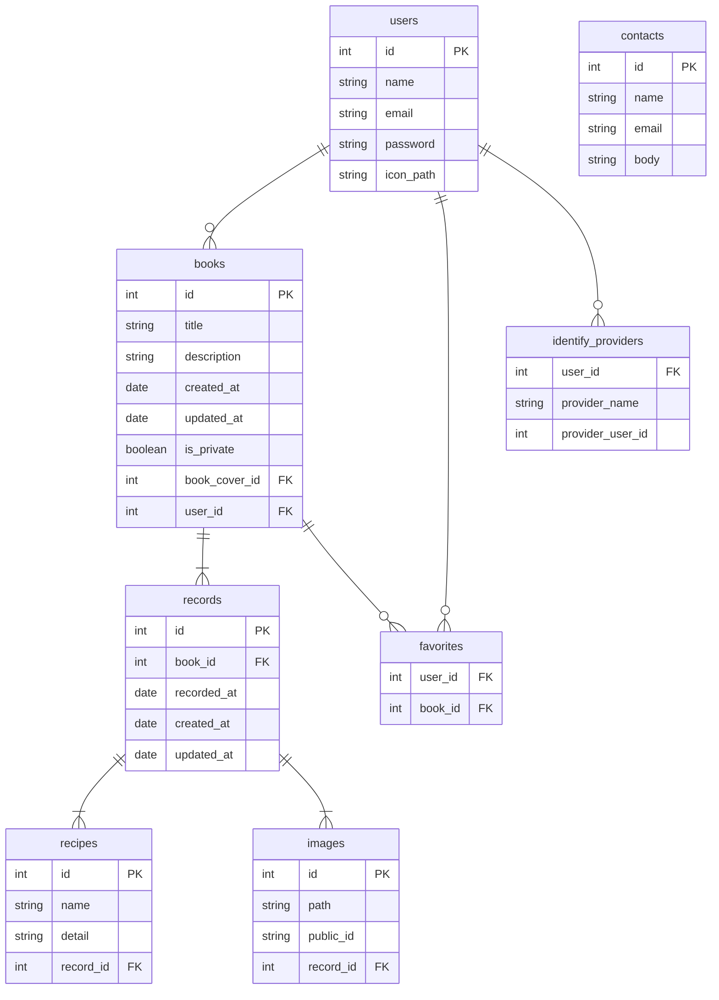

# Jisui6

## 概要
毎日の自炊を記録、共有するアプリケーションです。作った料理の画像をアップロードして管理でき、その時の料理一つひとつにレシピや参考にしたリンク、食材などのメモを取ることができます。他の人の投稿を見ることができます。

## 制作背景
大学生になり、一人暮らしをしていて毎日自炊をしていると、過去に作った料理をもう一度作りたいと思うことがありました。毎日の自炊を記録に残すことでレシピを思い出したり、記録に残すための楽しく料理を作ることができると考えました。

## URL
https://jisui6-700305e97f73.herokuapp.com/

## 使い方
アカウント作成後、自炊録を作成し、毎日の料理を記録する。

## 使用技術
### フロントエンド
- React 18
- react-query 4.29.1
- react-router 6.10.0
- react-toastify 9.1.2
- react-helmet-async
- swiper 9.2.3
- query-string
- axios 1.1.2
- tailwind 3.3.1
- preline 1.7.0
- tabler-icon

### バックエンド
- Lravel 10
- Laravel Sail 1.18

### デプロイ
- Heroku

### 外部API
- Cloudinary
- Google OAuth

## ER図

## URL設計
### API側
|内容|メソッド|URL|認証|
|:--|:--|:--|:--:|
|ユーザーのBook一覧|GET|/api/books|◯|
|公開されているBook一覧|GET|/api/books/all|◯|
|Book作成|POST|/api/books|◯|
|Book更新|PATCH|/api/books/{book}|◯|
|Book削除|DELETE|/api/books/{book}|◯|
|Record作成|POST|/api/books/{book}|◯|
|Record更新|PATCH|/api/books/{book}/{record}|◯|
|Record削除|DELETE|/api/books/{book}/{record}|◯|
|お気に入り一覧|GET|/api/favorites|◯|
|お気に入り登録|POST|/api/favorites|◯|
|お気に入り解除|POST|/api/favorites/{book}|◯|
|ユーザー登録|POST|/api/register||
|ログイン|POST|/api/login||
|ログアウト|POST|api/logout||
|OAuthURLの取得|GET|/api/login/{provider}||
|OAuthログイン|POST|/api/login/{provider}/callback||

### フロントエンド側
|内容|URL|認証|
|:--|:--|:--:|
|TOP|/|✗|
|ログイン|/login|✗|
|ユーザー登録|/register|✗|
|ホーム|/home|◯|
|公開|/share|◯|
|自炊録詳細|/book|◯|
|記録確認|/book/detail|◯|
|アカウント設定|/mypage|◯|
|お問い合わせ|/contact|◯|
|ログアウト|/logout|◯|